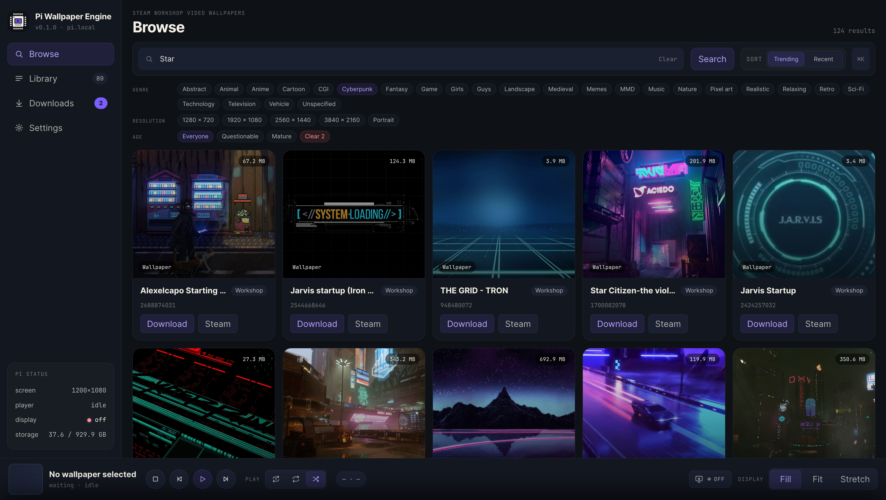

# Pi Wallpaper Engine

A Wallpaper Engine video player for the Raspberry Pi 4B. Use the web interface from your phone or computer to browse the Steam Workshop, download video wallpapers, and play them directly on your TV via mpv.



## Features

- **Direct Playback**: Downloads and plays original Workshop video files directly on the Pi.
- **Remote Control**: Mobile-friendly web UI for managing your library, rotating playlists (sequential, shuffle, or single loop), and setting sleep timers.
- **Display Power Management**: Automatically turns the TV on when playback starts and off when idle.
- **Storage Management**: Store wallpapers anywhere on the Pi. The UI includes a directory browser to safely move your media library across drives.
- **Optional NAS Transcoding**: Avoid overloading the Pi's CPU. Deploy a companion Docker worker to an Intel NAS to handle heavy HEVC conversions.
- **Secure Access**: Enable Passkey authentication if you expose the web UI to the internet via Cloudflare Tunnel or a reverse proxy.

## Requirements

- Raspberry Pi 4B
- Debian 13 Trixie (aarch64)
- Bun 1.2+
- Steam Web API key
- SteamCMD account login

*Note: SteamCMD is installed through box86 plus Valve's official tarball automatically. Do not use the Debian `steamcmd:i386` package on Trixie aarch64.*

## Install

Run from the project root on the Pi:

```bash
bash install-pi.sh
```

The installer will install system dependencies (mpv, ffmpeg, rsync, box86), build the frontend, prompt for your Steam credentials to create `config.json`, and run a full diagnostic check.

To install and enable the systemd service for automatic startup:

```bash
bash install-pi.sh --service
```

## Configure

`config.json` stores your local settings. The SQLite state database remains isolated at:
`~/.local/state/pi-wallpaper-engine/`

Local media files live in the directory specified by your configuration. You can change this directory at any time from the Storage settings page in the UI, and the system will safely migrate your files in the background.

## Start

Start both the backend and frontend in development mode:

```bash
bun run dev
```

Open `http://<pi-ip>:5173` in your browser.

In service (production) mode, the backend serves the built frontend on port 8080:

```bash
bun run service:start
bun run service:status
bun run service:stop
```

Follow the production logs:

```bash
journalctl --user -u pi-wallpaper-engine -f
```

## Development

Run the diagnostic preflight to check system dependencies, Steam login state, and hardware decode support:

```bash
bun run check
```

Other common commands:

```bash
bun install
bun test
bun run typecheck
bun run --filter @pwe/frontend build
```

For architecture details, workspace structure, and design decisions, read `CONTEXT.md` and the `docs/adr/` directory. Active development tasks are tracked in `plans/iteration-backlog.md`.

Uninstall instructions are available in [docs/uninstall.md](docs/uninstall.md).
